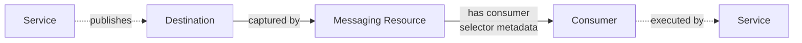
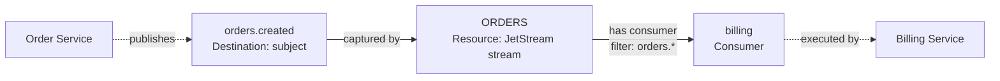
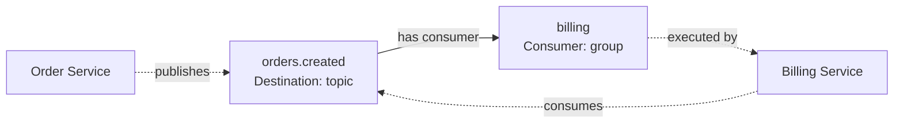
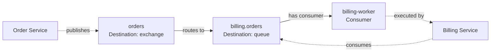

# EventAtlas Domain Model

## Purpose

EventAtlas discovers and visualizes the topology of event-driven systems. Its
domain model describes messaging concepts without making NATS, Kafka,
RabbitMQ, or any future integration the center of the product.

The model must answer these questions:

- Which logical services participate in an environment?
- Which messaging destinations do services publish to or consume from?
- Which broker resources capture, route, retain, or expose messages?
- Which consumer identities receive messages?
- Which relationships are declared by infrastructure and which are observed
  from application behavior?
- When and how was each fact learned?

The guiding constraint is:

> EventAtlas is an event-driven topology model. NATS and JetStream are its
> first integration, not its domain model.

This document defines the initial conceptual model. It intentionally avoids a
storage schema, public API schema, and Go package design. Those representations
may evolve independently while preserving the domain semantics defined here.

## Modeling Principles

### Vendor-neutral core

Core concepts use messaging terminology that remains meaningful across
providers. Provider vocabulary is preserved as metadata or resource kinds,
not promoted to universal concepts.

For example, a NATS subject, Kafka topic, and RabbitMQ queue can all be
represented as destinations. A JetStream stream remains identifiable as a
provider resource with kind `stream`; the core does not assume every provider
has an equivalent stream entity.

### Facts with provenance

Every topology relationship is a fact with explicit provenance. EventAtlas
does not treat broker configuration and runtime telemetry as interchangeable.

- **Declared facts** describe configured broker topology.
- **Observed facts** describe application behavior measured at runtime.

The same relationship may have evidence from multiple sources. Evidence is
retained independently so that freshness, confidence, and conflicts remain
visible.

### Logical identity over runtime identity

Topology nodes represent logical entities. A service node represents
`order-service`, not one pod or process. Runtime identities such as pod name,
client connection, process ID, and host belong in observations or metadata.

### Provider details remain available

Normalization must not discard information needed for diagnostics or future
features. The core stores a stable set of common fields and permits namespaced
provider metadata for details that have no portable meaning.

Provider metadata must not alter the meaning of core relationships.

### Snapshots are source-scoped

A discovery result is authoritative only for the scope the source inspected.
An empty result for one broker does not imply that services or resources from
another broker no longer exist.

## Ubiquitous Language

| Term | Meaning |
| --- | --- |
| Topology | A graph of messaging entities and the relationships between them. |
| Node | A typed entity that can participate in topology relationships. |
| Edge | A directed relationship between two nodes. |
| Evidence | The provenance and temporal data supporting an edge. |
| Snapshot | A source-scoped, point-in-time view of discovered topology. |
| Provider | An adapter that discovers declared messaging topology. |
| Observation source | An adapter that supplies measured behavior. |
| Destination | A named address used to publish, route, or consume messages. |
| Messaging resource | A provider construct that handles messages. |
| Consumer | A logical broker-side consumption identity or subscription. |

## Topology Graph

The topology is a directed, typed property graph. Nodes and edges have stable
identities within a topology scope. Metadata enriches the graph but does not
define its core semantics.



Solid edges usually represent declared facts. Dashed edges usually represent
observed facts. Edge kind and evidence source are separate dimensions: the
visual convention is useful but is not a domain invariant.

## Identity and Scope

Every node has an opaque `NodeId`. Consumers of the domain model must not parse
business meaning from that identifier.

Identity is evaluated within a `TopologyScope`, consisting of at least:

- environment;
- tenant or organization, when EventAtlas becomes multi-tenant;
- provider instance for broker-owned entities.

A provider instance identifies one configured discovery target, such as a
NATS cluster, Kafka cluster, or RabbitMQ virtual host. Two resources with the
same name in different provider instances are different nodes.

Services use logical service identity within an environment. Deployments,
replicas, and versions enrich that identity but do not create separate service
nodes by default.

Names can change and are not assumed to be globally unique. Providers should
use durable provider identifiers when available and otherwise derive a stable
identifier from the provider instance, entity kind, and provider-native name.

## Core Entities

### Service

A `Service` is a logical application or workload that publishes or processes
messages.

Core attributes:

| Attribute | Description |
| --- | --- |
| `id` | Stable opaque identity. |
| `name` | Logical service name, normally aligned with OTel `service.name`. |
| `environment` | Deployment environment containing the logical service. |

Common enrichment attributes include service version, namespace, team, and
deployment identifiers. Instance IDs, pod names, and process IDs are not part
of logical service identity.

Services are normally learned from observation sources rather than broker
configuration.

### Broker

A `Broker` identifies the messaging system instance in which provider-owned
topology exists.

Core attributes:

| Attribute | Description |
| --- | --- |
| `id` | Stable opaque identity. |
| `name` | Human-readable instance name. |
| `provider` | Messaging technology, such as `nats`, `kafka`, or `rabbitmq`. |
| `environment` | Environment in which the broker is used. |

Cluster members and server processes are operational details, not separate
broker nodes in the initial topology model. A provider can expose them later
as provider resources if they become useful.

### Destination

A `Destination` is a named messaging address used to publish, route, or
consume messages. It is the portable alternative to using `Subject` or `Topic`
as a core concept.

Core attributes:

| Attribute | Description |
| --- | --- |
| `id` | Stable opaque identity. |
| `name` | Provider-native physical name or address. |
| `kind` | Category: `subject`, `topic`, `queue`, or `exchange`. |
| `brokerId` | Broker that owns or resolves the destination. |
| `logicalName` | Optional normalized address used to control cardinality. |

`name` preserves the physical destination, for example
`orders.customer.12345.created`. `logicalName` may contain a controlled pattern
such as `orders.customer.*.created`. The logical name is not inferred by the
core. It must be supplied by trusted instrumentation or explicit mapping
configuration.

A destination can be concrete or pattern-based. Pattern semantics are
provider-specific, so provider metadata records the native syntax. Core code
must not assume that NATS wildcards, AMQP bindings, and Kafka subscriptions
behave identically.

A provider-native consumer selector is not a destination merely because it
contains an address or wildcard expression. A selector such as a JetStream
consumer filter is scoped to the relationship between its stream and consumer;
it is stored as evidence metadata on that relationship.

### Messaging Resource

A `MessagingResource` is a named, provider-managed construct that participates
in message capture, retention, routing, or delivery but is not adequately
described as a destination or consumer.

Core attributes:

| Attribute | Description |
| --- | --- |
| `id` | Stable opaque identity. |
| `name` | Provider-native resource name. |
| `kind` | Namespaced resource kind, such as `nats.jetstream.stream`. |
| `brokerId` | Broker that owns the resource. |

This entity prevents a JetStream-specific `Stream` abstraction from becoming
mandatory for every integration. The UI may label known resource kinds with
provider-native terms such as “Stream”.

Resources should only become nodes when they add meaningful topology. Kafka
partitions, NATS replicas, or RabbitMQ channels should remain metadata unless a
product use case requires users to navigate them as graph entities.

### Consumer

A `Consumer` is a logical broker-side consumption identity, subscription, or
consumer group that controls message delivery.

Core attributes:

| Attribute | Description |
| --- | --- |
| `id` | Stable opaque identity. |
| `name` | Provider-native or derived logical name. |
| `kind` | Namespaced kind describing the provider construct. |
| `brokerId` | Broker that owns the consumer. |
| `durability` | `durable`, `ephemeral`, or `unknown`. |

Examples include a JetStream consumer, Kafka consumer group, and RabbitMQ
consumer subscription. Runtime members of a consumer group are not separate
consumer nodes in the initial model.

Selection configuration belongs to the relationship that serves a consumer,
not to the consumer node itself. This preserves its scope when a provider can
associate one consumer identity with multiple resources or destinations.

Some providers do not expose a durable consumer identity. In that case,
EventAtlas may omit the consumer node and connect a service directly to a
destination using observed evidence rather than fabricate an unstable entity.

### Node

`Node` is the graph representation shared by all core entities, not an
additional business entity.

Conceptually it contains:

```text
Node
  id
  kind
  displayName
  properties
```

`kind` is one of `service`, `broker`, `destination`, `resource`, or `consumer`.
Typed entities remain the source of invariants; a generic property map must not
replace them inside the domain model. The generic node representation is most
useful at API and visualization boundaries.

## Relationships

An `Edge` is a directed relationship between two nodes. Its identity is based
on topology scope, source node, relationship kind, and target node. Evidence is
attached separately, allowing one edge to be supported by multiple sources.

| Relationship | Source | Target | Meaning |
| --- | --- | --- | --- |
| `publishes` | Service | Destination | Publishes messages to the target. |
| `consumes` | Service | Destination | Processes messages from the target. |
| `captured_by` | Destination | Resource | Is captured by the target. |
| `has_consumer` | Resource or Destination | Consumer | Serves the consumer; provider selector configuration may enrich its evidence. |
| `executed_by` | Consumer | Service | Is executed by the service. |
| `routes_to` | Destination/Resource | Destination/Resource | Routes messages. |
| `belongs_to` | Provider-owned node | Broker | Belongs to the broker. |

The initial model allows only combinations listed in this table. New
combinations require an explicit semantic definition rather than relying on a
free-form edge label.

`consumes` and `executed_by` answer different questions. `consumes` captures
observed application behavior at a destination. `executed_by` correlates a
broker-side consumer identity with a logical service. Both may exist for the
same message path.

The canonical path through the graph is `Service -> Destination -> Resource ->
Consumer -> Service`, using `publishes`, `captured_by`, `has_consumer`, and
`executed_by`. Optional routing resources can extend the middle of that path.
`consumes` is a supporting observed correlation and is especially useful when
no stable broker-side consumer identity exists.

## Evidence and Observations

### Observation source

An `ObservationSource` identifies how EventAtlas learned a fact.

It has two independent classifications:

| Dimension | Examples |
| --- | --- |
| `mode` | `declared`, `observed` |
| `system` | `nats`, `kafka`, `rabbitmq`, `opentelemetry` |

`mode` communicates the nature of the evidence. `system` identifies the
adapter or external system that supplied it. OpenTelemetry is an observation
source with mode `observed`; it is not a discovery provider.

### Evidence

`Evidence` records support for an edge from one source.

Core attributes:

| Attribute | Description |
| --- | --- |
| `sourceId` | Configured provider or observation source instance. |
| `mode` | `declared` or `observed`. |
| `sourceSystem` | Originating technology or integration. |
| `firstSeen` | Earliest time this source reported the fact. |
| `lastSeen` | Most recent time this source reported the fact. |
| `observedCount` | Optional cumulative or windowed event count. |
| `rate` | Optional rate with an explicit unit and time window. |
| `metadata` | Source-specific evidence attributes. |

`firstSeen` and `lastSeen` describe knowledge in EventAtlas, not necessarily
the creation time of broker resources. Provider-reported timestamps may be
stored separately in metadata.

Counts and rates must carry aggregation semantics. A value without its time
window, temporality, and unit is ambiguous and should not enter the core model.

### Declared topology

Declared evidence comes from provider APIs or configuration. It commonly
supports relationships such as:

- destination `captured_by` resource;
- resource `has_consumer` consumer;
- exchange `routes_to` queue.

Provider-specific selectors qualify `has_consumer` evidence. They do not
create additional declared topology edges.

Declared evidence remains present while the relationship exists in successful
authoritative snapshots for its source scope.

### Observed topology

Observed evidence comes from runtime signals such as traces and metrics. It
commonly supports relationships such as:

- service `publishes` destination;
- service `consumes` destination;
- consumer `executed_by` service.

Observed relationships are time-bound. They become stale according to a
retention policy but must not be interpreted as deleted merely because no
message was observed in one collection interval.

### Conflicts and corroboration

Evidence is additive. If provider discovery and telemetry support the same
edge, both evidence records are retained. If they disagree, EventAtlas exposes
the discrepancy instead of silently choosing one source.

Examples of useful discrepancies include:

- a declared consumer with no recently observed service;
- a service publishing to a destination not captured by any declared resource;
- observed processing that cannot be correlated with a declared consumer.

## Topology Snapshot

A `TopologySnapshot` is an immutable, point-in-time result produced by one
discovery provider for one explicit scope.

Conceptually it contains:

```text
TopologySnapshot
  id
  sourceId
  scope
  capturedAt
  nodes
  edges
  completeness
  cursor
  metadata
```

The fields have the following semantics:

| Field | Meaning |
| --- | --- |
| `id` | Unique identity for this discovery result. |
| `sourceId` | Configured provider instance that produced it. |
| `scope` | Inspected broker, account, namespace, or virtual host boundary. |
| `capturedAt` | Time at which discovery completed. |
| `nodes` | Complete normalized nodes visible within the stated scope. |
| `edges` | Complete declared relationships visible within the scope. |
| `completeness` | `full` or `partial`, with partial-result errors. |
| `cursor` | Optional provider cursor or revision for reconciliation. |
| `metadata` | Namespaced provider details about discovery. |

A full snapshot can reconcile previously declared state for the same
`sourceId` and scope. Nodes and evidence absent from a newer full snapshot may
be retired. A partial snapshot must never cause absence-based deletion.

Snapshots contain declared topology only in the initial model. Runtime
observations have different lifecycle and aggregation semantics and therefore
enter through a separate ingestion boundary.

## Provider Contract

A `Provider` discovers declared topology and normalizes it into a snapshot.
The conceptual contract is:

```go
type Provider interface {
  Discover(ctx context.Context, scope DiscoveryScope) (TopologySnapshot, error)
}
```

The concrete Go interface may differ after implementation concerns are known.
The domain contract requires a provider to:

- identify its provider instance and discovery scope;
- return normalized core nodes and edges;
- attach declared evidence to every returned relationship;
- preserve provider-specific details in namespaced metadata;
- distinguish complete results from partial results;
- produce stable identities across repeated discovery runs;
- avoid emitting runtime application behavior as declared topology.

Incremental events and advisories are an optimization around this contract.
Periodic full discovery remains the reconciliation mechanism and semantic
baseline.

## Observation Source Contract

Observation ingestion is separate from provider discovery. An observation
source emits normalized runtime facts rather than authoritative snapshots.

Conceptually, each fact identifies:

- source and target node identities or identity hints;
- relationship kind;
- source system;
- event or aggregation time;
- count, rate, and metadata when available.

Identity resolution may create previously unknown service or destination nodes.
It must use the same topology scope and destination normalization rules as
provider discovery to make correlation possible.

## Core and Provider-specific Boundaries

The core owns concepts whose semantics are consistent across providers:

- topology scope and opaque identity;
- services, brokers, destinations, resources, and consumers;
- allowed relationship kinds and endpoint constraints;
- declared and observed evidence;
- snapshot completeness and reconciliation semantics;
- physical and logical destination identity.

Providers own details whose semantics depend on a messaging technology:

- native API clients and authentication;
- wildcard and filter interpretation;
- stream retention and replica configuration;
- topic partitions and offsets;
- exchanges, bindings, routing keys, and virtual hosts;
- native health, lag, and delivery metrics;
- conversion from native identifiers to stable core identities.

Provider metadata keys must be namespaced, for example:

```text
nats.jetstream.retention
kafka.partition_count
rabbitmq.exchange_type
```

Metadata is for enrichment and round-trip diagnostics. Core behavior must not
branch on arbitrary metadata keys when a stable domain concept is required.

## Cross-provider Validation

### NATS and JetStream

| Native concept | Core representation |
| --- | --- |
| NATS deployment or account discovery target | Broker and discovery scope |
| Subject | Destination with kind `subject` |
| Wildcard subject | Pattern destination with native pattern metadata |
| JetStream stream | Messaging resource with kind `nats.jetstream.stream` |
| Stream subject configuration | Destination `captured_by` resource |
| JetStream consumer | Consumer with kind `nats.jetstream.consumer` |
| Consumer attached to stream | Resource `has_consumer` consumer |
| Consumer filter subject | Namespaced metadata on `has_consumer` evidence |
| Application publish | Service `publishes` destination, observed |
| Application processing | Service `consumes` destination, observed |

No NATS-only entity or relationship is required in the core.

### Kafka

| Native concept | Core representation |
| --- | --- |
| Kafka cluster | Broker |
| Topic | Destination with kind `topic` |
| Consumer group | Consumer with kind `kafka.consumer_group` |
| Group subscription | Destination `has_consumer` consumer |
| Group subscription pattern | Namespaced metadata on `has_consumer` evidence; not a destination by itself |
| Application produce | Service `publishes` destination, observed |
| Application consume | Service `consumes` destination, observed |
| Partition and replica data | Provider metadata initially |

Kafka does not require a `MessagingResource` between topic and consumer. This
validates that resources are optional rather than a mandatory stream layer.

### RabbitMQ

| Native concept | Core representation |
| --- | --- |
| Cluster and virtual host discovery target | Broker and discovery scope |
| Exchange | Destination with kind `exchange` |
| Queue | Destination with kind `queue` |
| Exchange binding | Exchange destination `routes_to` exchange destination |
| Queue binding | Exchange destination `routes_to` queue destination |
| Binding routing key or pattern | Provider metadata on `routes_to` evidence |
| Consumer subscription | Consumer with kind `rabbitmq.consumer` |
| Queue subscription | Queue destination `has_consumer` consumer |
| Application publish | Service `publishes` exchange destination, observed |
| Application processing | Service `consumes` queue destination, observed |

RabbitMQ validates that routing can occur directly between destinations and
that queues and exchanges need distinct destination kinds without becoming
separate universal entities.

## Representative Topologies

### JetStream message path



### Kafka message path



### RabbitMQ message path



## Invariants

The initial domain model enforces these invariants:

1. Every provider-owned node belongs to exactly one broker within one topology
   scope.
1. A node identity is stable across equivalent discovery runs.
1. Every edge uses a defined relationship kind and an allowed source-target
   combination.
1. Every edge has at least one evidence record.
1. Declared and observed are evidence modes, not node or edge kinds.
1. A partial snapshot cannot remove previously discovered state.
1. Provider metadata cannot redefine core identity or relationship semantics.
1. Logical service identity never includes a replica-specific identifier.
1. A logical destination pattern is explicit and is never guessed by the core.
1. Observation sources cannot claim authority over broker configuration.

## Deliberate Non-goals

The initial model does not attempt to represent:

- individual messages, payloads, or trace spans as topology nodes;
- broker servers, replicas, partitions, or application pods as default nodes;
- every native provider setting as a typed core property;
- workflow choreography, business process state, or message schemas;
- arbitrary user-defined edge kinds;
- historical topology storage layout;
- authorization boundaries or multi-tenant access policy;
- a universal equivalence between provider wildcard languages.

These concerns can be added when product requirements demonstrate that they
belong in the navigable topology rather than in metadata or specialized views.

## Open Decisions

The following decisions should be resolved during the first implementation
slice without changing the model's provider-neutral boundary:

- the canonical encoding and generation strategy for opaque node IDs;
- whether broker membership is represented by explicit `belongs_to` edges in
  stored snapshots or derived from `brokerId`;
- the exact taxonomy and versioning policy for destination and resource kinds;
- retention and staleness thresholds for observed evidence;
- how cumulative and delta metric observations are normalized;
- how identity hints from telemetry are reconciled with provider-discovered
  destinations across aliases and protocol endpoints;
- whether ephemeral consumers are persisted, aggregated, or omitted by
  default.

These are implementation and policy decisions. None requires NATS, Kafka, or
RabbitMQ concepts to become privileged core abstractions.
