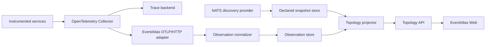

# EventAtlas Observation Architecture

## Purpose

EventAtlas uses runtime observations to identify application relationships
that broker configuration cannot declare. The first observation source is
OpenTelemetry trace data delivered through OTLP. This document defines the
transport boundary, normalization contract, identity rules, lifecycle, and
first implementation slice.

Observed facts complement broker discovery. They never replace provider
snapshots and never make absence authoritative.

## System Boundary



The Collector is recommended but not mandatory. Any conforming OTLP/HTTP
exporter may send traces to EventAtlas. The backend accepts telemetry, extracts
topology facts, and discards the raw request after processing.

The first implementation remains inside the existing Go process with explicit
ports and adapters:

```text
OTLP transport adapter
  -> observation normalization
  -> observation application service
  -> observation store port
  -> PostgreSQL adapter

declared store + observation store
  -> topology projector
  -> HTTP API adapter
```

## Current Scope

The first slice supports one relationship:

```text
publishing Service -> publishes -> declared Destination
```

It deliberately excludes:

- consumer processing and `executed_by` correlation;
- direct `consumes` relationships;
- observed-only destination nodes;
- OTLP/gRPC, OTLP/JSON, metrics, logs, and profiles;
- raw trace storage and trace search;
- exact traffic counts, rates, latency, and error metrics;
- multiple environments or broker instances in one process;
- historical topology browsing.

These boundaries let EventAtlas validate ingestion, persistence, expiry, and
projection before adding less reliable identity mappings.

## OTLP Transport Contract

The receiver exposes `POST /v1/traces` over HTTP with binary Protocol Buffers.
It accepts the OTLP `ExportTraceServiceRequest` and returns the corresponding
OTLP response message. It accepts uncompressed and gzip-compressed request
bodies. The configured request limit applies both to bytes received on the
wire and to bytes produced after decompression.

The listener is separate from the Huma API listener:

| Concern | Topology API | OTLP receiver |
| --- | --- | --- |
| Default local address | `:8080` | `:4318` when enabled |
| Payload | JSON | Protobuf |
| Primary caller | Browser or API client | Collector or OTLP exporter |
| Request profile | Read-oriented | Batched write-oriented |
| Documentation | OpenAPI and Stoplight | OTLP specification |

The ingestion runtime configuration is:

| Variable | Default | Meaning |
| --- | --- | --- |
| `EVENTATLAS_OTLP_HTTP_ADDRESS` | empty | OTLP listener address; empty disables ingestion. |
| `EVENTATLAS_OTLP_SOURCE_ID` | `observation:otel:default` | Stable observation source. |
| `EVENTATLAS_OTLP_MAX_REQUEST_BYTES` | `67108864` | Maximum on-wire and decompressed request size. |
| `EVENTATLAS_OTLP_MAX_FUTURE_SKEW` | `5m` | Maximum accepted clock skew into the future. |

Ingestion remains opt-in outside the local Compose environment. Observation
retention is configured through `EVENTATLAS_OBSERVATION_RETENTION` and defaults
to 24 hours.

### Response Behavior

- A fully accepted batch returns `200` with an empty-success OTLP response.
- A partially accepted batch returns `200` with `partial_success`, rejected
  span count, and a bounded diagnostic message.
- Malformed Protobuf and gzip return `400`; unsupported content type or content
  encoding returns `415`; an oversized body returns `413`.
- Temporary store failures return `503`.
- Overload and admission limits return `429` or `503`, optionally with
  `Retry-After`.

Successful responses serialize `ExportTraceServiceResponse`. Error responses
serialize `google.rpc.Status`. Both use `application/x-protobuf`; the receiver
never returns a JSON error envelope on the OTLP endpoint.

The receiver acknowledges a fact only after its durable upsert succeeds.

## Normalized Observation Fact

The transport adapter does not create topology nodes or edges directly. It
emits an application-owned value conceptually shaped as:

```text
ObservationFact
  sourceId
  scope
  observedAt
  relationshipKind
  serviceIdentity
    environment
    namespace
    name
  destinationHint
    messagingSystem
    physicalName
    logicalName
  metadata
```

The fact contains identity hints because an observation source cannot
authoritatively assign a provider-owned destination ID. Resolution happens
while building the merged topology view.

`metadata` is an allow-listed, low-cardinality map. The first slice may retain
the resource and scope schema URLs, instrumentation scope name and version,
and whether the environment came from the resource or configured fallback. It
must not become a copy of arbitrary OTLP attributes.

## Span Eligibility and Mapping

One OTLP request contains resource spans, instrumentation scopes, and spans.
Each span is evaluated independently so one invalid span does not reject an
otherwise useful batch.

Normalization classifies every span into one of three bounded outcomes:

| Outcome | Meaning | OTLP partial success |
| --- | --- | --- |
| `accepted` | A valid `send` span produced one observation fact. | Not rejected. |
| `ignored` | The span is outside the publishing slice, such as HTTP, database, `receive`, or `process`. | Not rejected. |
| `rejected` | The span claimed to be a messaging `send` operation but its required identity, destination, or timestamp was invalid. | Increments `rejected_spans`. |

This distinction is important because a normal trace export contains many
span kinds. EventAtlas must not report unrelated telemetry as invalid. A
request cancellation discards any partially normalized in-memory result. The
accepted facts from a completed request form one atomic persistence batch.

### Service identity

| OpenTelemetry resource attribute | EventAtlas use |
| --- | --- |
| `service.name` | Required logical service name. |
| `service.namespace` | Optional namespace participating in service identity. |
| `deployment.environment.name` | Must match the configured environment when present. |
| `service.instance.id` | Diagnostic only; never logical identity. |
| `service.version` | Optional enrichment; never logical identity. |

The logical service key is:

```text
environment + service.namespace + service.name
```

An absent namespace is a valid distinct namespace. SDK-generated values
beginning with `unknown_service` are rejected because executable names are not
reliable logical identities.

### Publishing operation

A span produces a `publishes` fact when:

```text
messaging.operation.type = send
messaging.system          = supported configured system
messaging.destination.name is present
```

`create`, `receive`, `process`, and `settle` spans do not produce a publishing
fact. Mapping only `send` avoids double-counting instrumentations that emit
both `create` and `send` spans.

`messaging.destination.name` is the physical destination hint.
`messaging.destination.template`, when present, is the preferred
low-cardinality logical hint. Values are trimmed, length-bounded, and validated
before storage. Temporary or anonymous destinations are rejected in the first
slice. For NATS, subjects under `_INBOX.` are treated as temporary reply
destinations and rejected.

The OpenTelemetry registry currently has no NATS-specific convention. The
adapter accepts the custom `messaging.system=nats` value for the initial NATS
integration because the registry permits custom low-cardinality system values.
Provider-specific aliases remain adapter configuration, not domain constants.

### Observation time

`observedAt` is the span end time when valid, falling back to start time only
when necessary. Future timestamps beyond a configured skew are rejected.
Late-arriving spans are accepted and merge their time range without moving
`lastSeen` backwards.

## Privacy and Cardinality

EventAtlas retains only fields needed for topology identity and diagnostics.
It discards:

- trace and span IDs;
- parent and link identifiers;
- message and conversation IDs;
- payloads, headers, and baggage;
- user, tenant, and end-user attributes;
- arbitrary resource, scope, event, and span attributes;
- exception messages and stack traces.

Attribute values have explicit length limits. A source or scope may have a
configured ceiling for active services, destinations, and relationship keys.
Exceeding an admission limit rejects new keys without dropping already known
facts.

## Destination Correlation

The observation fact carries names, while broker discovery owns destination
nodes and opaque IDs. The topology projector resolves an active fact against
the current declared topology in this order:

1. find destinations in the configured broker whose logical name or native
   pattern equals `messaging.destination.template`;
2. otherwise find destinations whose physical name equals
   `messaging.destination.name`;
3. accept the result only when exactly one destination matches.

A unique match reuses the declared destination `NodeId`. An unmatched or
ambiguous fact remains persisted as unresolved diagnostic state. It can resolve
automatically after a later successful broker discovery. It does not create an
observed-only destination in the first slice.

This resolution policy avoids duplicating provider-owned nodes while current
NATS identities remain scoped to their discovery source. A later phase may
introduce observed-only destinations and explicit aliases after their identity
and migration semantics are defined.

## Persistence and Lifecycle

Provider snapshots remain in the declared topology tables documented in
`persistence.md`. Observations use a separate store and schema because they
have different authority, update frequency, and retention semantics.

The observation store upserts one aggregate for each fact identity:

```text
source + scope + relationship kind + service key + destination hint
```

Each aggregate retains:

| Field | Meaning |
| --- | --- |
| `firstSeen` | Earliest accepted observation time. |
| `lastSeen` | Latest accepted observation time. |
| `observationCount` | Approximate number of accepted span observations. |
| `metadata` | Allow-listed normalization diagnostics. |

OTLP delivery is at least once, so `observationCount` is diagnostic and must
not be exposed as an exact message count. The first slice does not persist
trace or span IDs for deduplication.

An observation is active while:

```text
now <= lastSeen + retention
```

The initial proposed retention is 24 hours and remains configurable. Expired
facts are omitted from projections and may be deleted asynchronously. Expiry
means only that a relationship was not recently observed. It cannot delete a
declared node, edge, or evidence record.

## Merged Topology View

A `TopologySnapshot` remains the immutable, authoritative output of one
provider source and scope. It cannot honestly represent evidence from several
sources. The application therefore introduces a separate read model,
conceptually:

```text
TopologyView
  generatedAt
  scope
  contributingSources
  nodes
  edges
  diagnostics
```

The projector combines:

- the current declared provider snapshot;
- active, successfully resolved observation facts.

For the first slice it creates stable service nodes from the logical service
key and adds `Service -> publishes -> Destination` edges with evidence mode
`observed` and source system `opentelemetry`. Declared edges keep their original
evidence. No observation changes snapshot reconciliation.

The public API exposes the merged view rather than pretending it is a
single-source provider snapshot. Its top-level contract is:

```text
view
  generatedAt
  scope
  sources[]
    sourceId
    mode
    latestAt
  diagnostics
    unresolvedObservations
    ambiguousObservations
nodes[]
edges[]
  evidence[]
```

The backend and web app consume this contract together and retain evidence
provenance for every edge. The declared snapshot remains an internal
authoritative input to reconciliation; its identifier is not presented as the
identity of the merged result.

## Failure Semantics

- OTLP ingestion failure does not make the declared topology unavailable.
- Provider discovery failure does not discard active observations.
- A persistence transaction accepts all valid facts in a batch atomically or
  returns a retryable failure.
- Invalid spans are reported through partial success and do not block valid
  spans in the same request.
- Projection or declared-store read failure leaves the last successfully
  generated in-process view available. Before the first successful projection,
  the API returns an error instead of fabricating an empty view.
- Missing telemetry never produces absence-based deletion of declared state.

## Operational Signals

The implementation should expose or log bounded diagnostics for:

- requests, spans, and bytes received;
- facts accepted, rejected, unresolved, resolved, and expired;
- rejection reasons by low-cardinality category;
- normalization and persistence latency;
- store and projection failures;
- active observation cardinality by source and scope.

Diagnostics must not contain discarded high-cardinality identifiers.

## First Vertical Slice Acceptance Criteria

The publishing slice is complete when:

- an OTLP/HTTP protobuf trace batch is accepted on the optional listener;
- an eligible NATS send span produces one normalized publishing fact;
- malformed and mixed-validity batches return conforming OTLP responses;
- PostgreSQL preserves `firstSeen`, `lastSeen`, and approximate count across a
  backend restart;
- a fact resolves to an existing declared NATS destination using a logical
  template or exact physical name;
- the topology view contains the service, the declared destination, and a
  `publishes` edge with observed evidence;
- expiry removes the observed edge from the view without changing declared
  topology;
- API and web app distinguish declared and observed evidence;
- the local Compose environment includes a Collector and a reproducible demo
  publisher;
- unit, PostgreSQL, OTLP, and end-to-end integration tests run in CI.

## Planned Follow-up Slices

1. map consumer `process` spans to `Service -> consumes -> Destination`;
2. correlate subscription or consumer hints to
   `Consumer -> executed_by -> Service`;
3. support observed-only destinations with explicit identity and alias rules;
4. enrich the view with approximate activity and staleness;
5. evaluate metrics-based aggregation for higher-volume deployments;
6. add OTLP/gRPC if deployment requirements justify it.

## References

- [Topology domain model](domain-model.md)
- [Topology persistence](persistence.md)
- [ADR-0005: Separate Declared and Observed Topology](../adrs/0005-separate-declared-and-observed-topology.md)
- [ADR-0006: Treat OpenTelemetry as an Observation Source](../adrs/0006-treat-opentelemetry-as-observation-source.md)
- [ADR-0010: Ingest Observations from OTLP Traces](../adrs/0010-ingest-observations-from-otlp-traces.md)
- [OTLP specification](https://opentelemetry.io/docs/specs/otlp/)
- [OpenTelemetry messaging spans](https://opentelemetry.io/docs/specs/semconv/messaging/messaging-spans/)
- [OpenTelemetry messaging attributes](https://opentelemetry.io/docs/specs/semconv/registry/attributes/messaging/)
- [OpenTelemetry service resources](https://opentelemetry.io/docs/specs/semconv/resource/service/)
